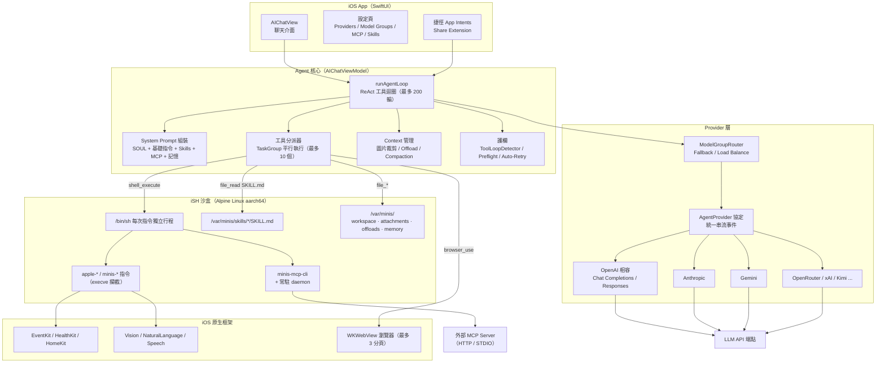
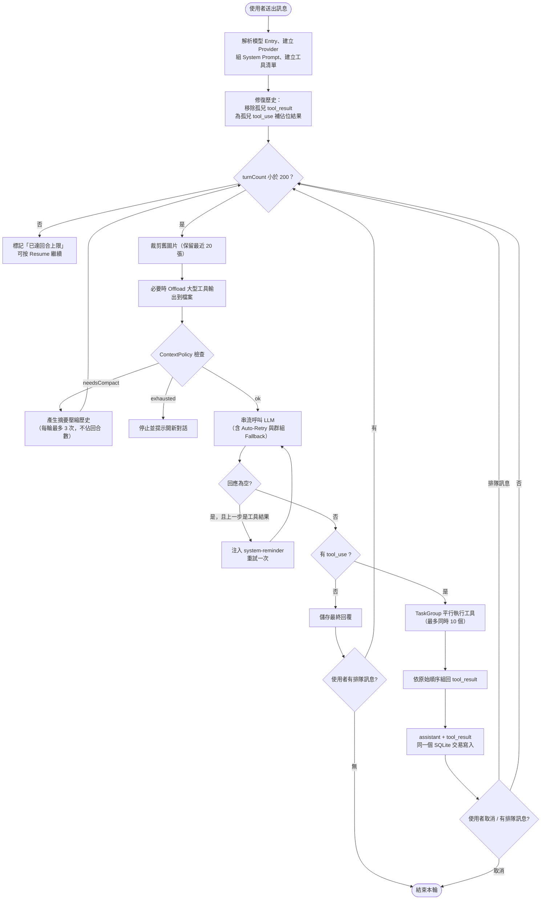
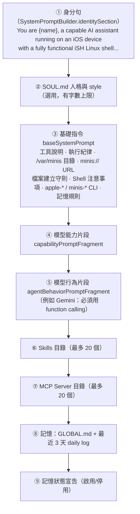
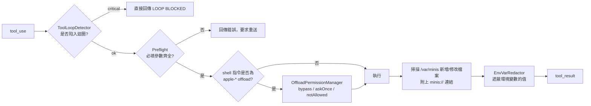
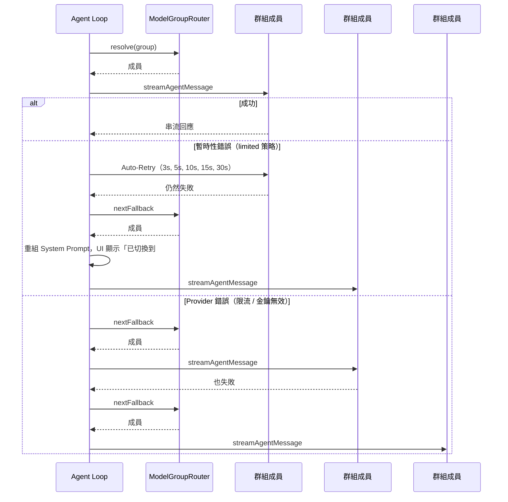
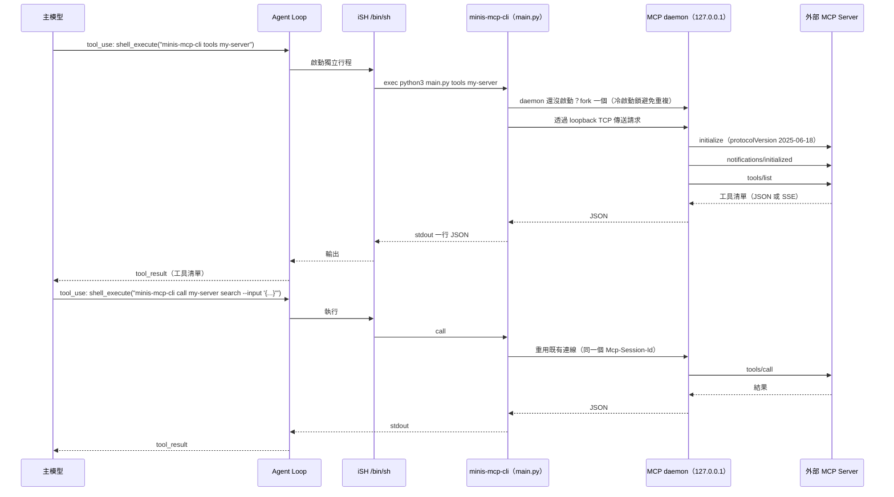
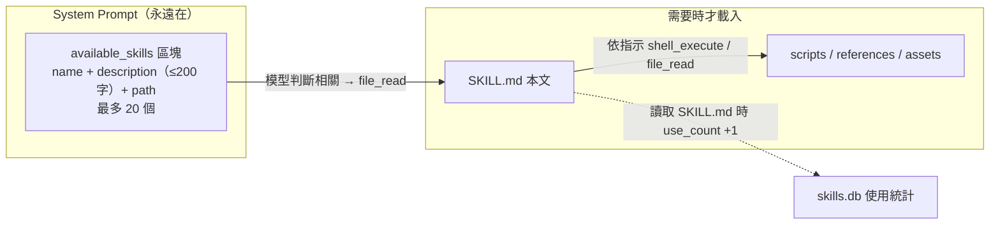
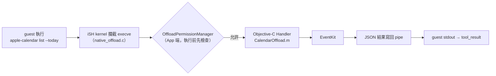
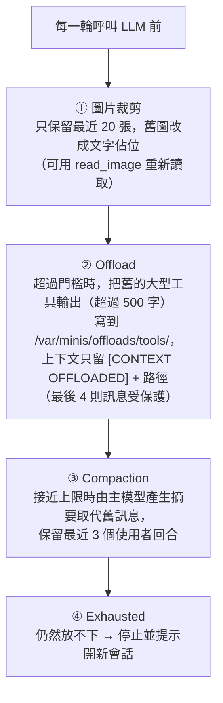
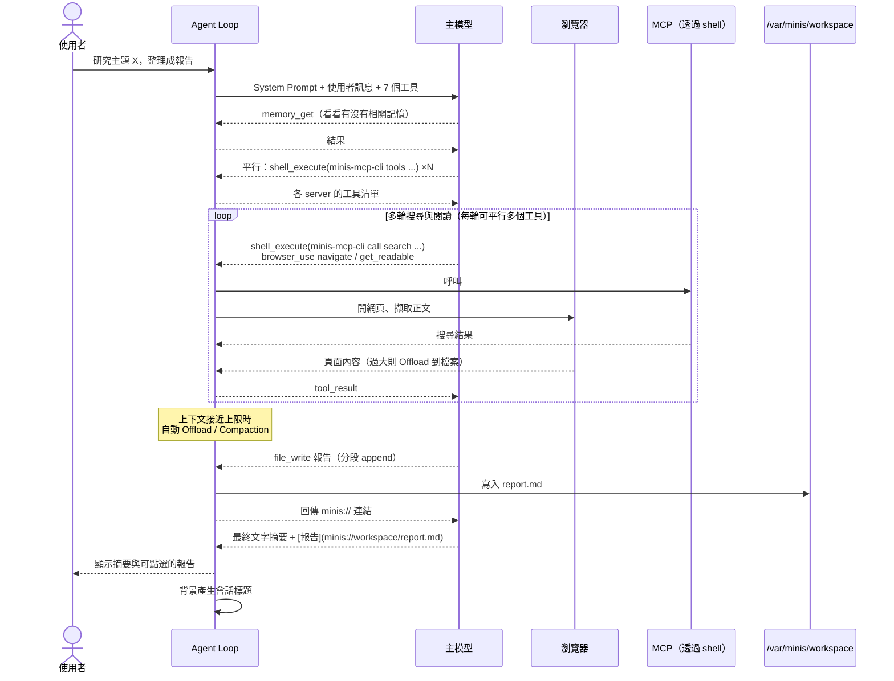

# OpenMinis 架構解析（iOS）

> 本文件依據 `src/ios/` 原始碼整理，說明 OpenMinis 的 Agent 如何規劃與執行任務、如何選用模型、如何呼叫 MCP 與 Skill，以及背後的 Linux 沙盒。
> 文中的 `路徑:行號` 皆為原始碼位置，方便對照閱讀。Android 版（`src/android/`）採用相同的設計，只是沙盒改用 PRoot。

---

## 目錄

1. [一句話總結](#1-一句話總結)
2. [整體架構](#2-整體架構)
3. [Agent 迴圈：Minis 如何「規劃」與執行](#3-agent-迴圈minis-如何規劃與執行)
4. [System Prompt 是怎麼組出來的](#4-system-prompt-是怎麼組出來的)
5. [原生工具（Native Tools）](#5-原生工具native-tools)
6. [模型選用：Model Group、Fallback 與子模型](#6-模型選用model-groupfallback-與子模型)
7. [MCP 呼叫機制](#7-mcp-呼叫機制)
8. [Skill 機制](#8-skill-機制)
9. [iOS 上的 Linux 沙盒與 Native Offload](#9-ios-上的-linux-沙盒與-native-offload)
10. [瀏覽器自動化（browser_use）](#10-瀏覽器自動化browser_use)
11. [上下文（Context）管理](#11-上下文context管理)
12. [穩定性護欄](#12-穩定性護欄)
13. [記憶系統與人格（SOUL.md）](#13-記憶系統與人格soulmd)
14. [一個研究型任務的完整流程](#14-一個研究型任務的完整流程)
15. [值得借鏡的提示詞設計](#15-值得借鏡的提示詞設計)
16. [關鍵原始碼索引](#16-關鍵原始碼索引)

---

## 1. 一句話總結

**OpenMinis 是「單一 Agent + ReAct 工具迴圈 + 手機上的真 Linux」**：

- 沒有獨立的 Planner／多代理協調器。「規劃」完全交給主模型，靠一份精心設計的 System Prompt 引導，並由程式碼提供迴圈、平行工具執行、上下文壓縮與各種防呆。
- 原生註冊給模型的工具只有 **7 個**（`shell_execute`、`file_read`、`file_write`、`file_edit`、`browser_use`、`memory_write`、`memory_get`，外加視情況出現的 `read_image`）。
- **MCP 與 Skill 都不是原生 tool**。它們只在 System Prompt 裡放「目錄」，模型需要時再透過 `shell_execute` 呼叫沙盒內的 `minis-mcp-cli`，或用 `file_read` 讀取 `SKILL.md`。這是「漸進式揭露（progressive disclosure）」的設計，能讓提示詞保持精簡。
- 模型群組（Model Group）預設是 **Fallback 策略**：**永遠先用第一個可用的模型**，只有在出錯時才依序換下一個，並不是每一步輪流呼叫不同模型。

---

## 2. 整體架構



---

## 3. Agent 迴圈：Minis 如何「規劃」與執行

核心在 `src/ios/Agent/Chat/AIChatViewModel.swift:4724` 的 `runAgentLoop()`。它是一個標準的 **ReAct（Reason → Act → Observe）迴圈**：



### 3.1 關鍵常數

| 常數 | 值 | 位置 |
|---|---|---|
| `maxAgentTurns` | 200（一次任務最多呼叫 LLM 的輪數） | `AIChatViewModel.swift:73` |
| `maxInLoopCompactions` | 3（單次任務內自動壓縮上限） | `AIChatViewModel.swift:77` |
| `maxConcurrentTools` | 10（同一輪平行工具數） | `AIChatViewModel+ConcurrentTools.swift:25` |
| `kImageContextKeepCount` | 20（上下文保留圖片數） | `AIChatViewModel.swift:24` |
| `retryDelays` | 3、5、10、15、30 秒 | `AIChatViewModel+Fallback.swift:11` |

### 3.2 「規劃」到底在哪裡？

程式碼裡**沒有**「先產生計畫、再逐步執行」的 Planner 模組，也沒有多個 Agent 互相對話。規劃能力來自三個地方：

1. **模型本身的推理**：每一輪模型看到完整歷史（含上一步的工具輸出），自己決定下一步要呼叫哪些工具。
2. **平行工具呼叫**：模型可在同一輪送出多個 `tool_use`（例如同時開好幾個搜尋、讀好幾個檔案），程式用 `withTaskGroup` 平行執行，再依原順序回填結果（`AIChatViewModel.swift:5920`）。這是「看起來很會分工」的主要原因。
3. **System Prompt 的「執行紀律」**：明確要求「立刻呼叫工具，不要只描述打算做什麼」、「持續做到任務完成」、「絕不在回合結尾承諾『我等一下會再檢查』」（`AIChatViewModel.swift:1849-1852`）。

### 3.3 需要「分身」時的兩種作法

雖然沒有內建多代理，Agent 仍可透過沙盒 CLI 間接做到：

| 指令 | 行為 | 性質 |
|---|---|---|
| `minis-model-use run --model X` | 對另一個已設定的模型送一次 OpenAI Chat Completions 格式的請求（可生圖、TTS 等） | **單次呼叫**，沒有工具迴圈 |
| `minis-sessions-cli send` | 建立或延續另一個聊天會話，並在該會話啟動完整的 Agent 迴圈 | **另一個完整 Agent**，非阻塞，事後用 `status` / `messages` 查結果 |

實作分別在 `src/ios/NativeOffloads/ModelUseOffloadBridge.swift` 與 `SessionsOffloadBridge.swift:251`。

---

## 4. System Prompt 是怎麼組出來的

System Prompt 每次進入 `runAgentLoop` 都會重新組裝（`AIChatViewModel.swift:4786-4827`），層層疊加：



幾個設計細節：

- **時間只精確到「小時」**（`approximateTimeString`，`AIChatViewModel.swift:1809`），刻意讓 prompt 在一小時內保持不變，以便命中 Prompt Cache。
- **切換到 fallback 模型時會重組 prompt**（`applyFallbackSwitch`，`AIChatViewModel.swift:5259`），因為不同模型的能力／行為片段不同。
- **SOUL.md 會過濾注入攻擊**：含 "ignore previous instructions" 等字樣的行會被移除（`SoulStore.swift:1005`）。

---

## 5. 原生工具（Native Tools）

定義於 `src/ios/Agent/Chat/AIChatViewModel+ToolDefinitions.swift:30`。

| 工具 | 用途 | 設計重點 |
|---|---|---|
| `shell_execute` | 在沙盒執行任意指令 | 每次都是獨立 `/bin/sh -c` 行程；預設逾時 15 分鐘；有 `delay` 參數取代 `sleep` |
| `file_read` | 讀檔 | 支援 `offset`/`lines`/`direction: tail`；被截斷時回傳 `next_offset` |
| `file_write` | 寫檔 | 描述中明確要求 >8KB 分段 append，或寫腳本產生內容 |
| `file_edit` | 精準字串取代 | 要求先 `file_read`，`old_string` 必須唯一 |
| `browser_use` | 控制內建瀏覽器 | 22 種動作，見第 10 節 |
| `memory_write` / `memory_get` | 寫入／搜尋記憶 | 每個會話可關閉，關閉時連工具都不註冊 |
| `read_image` | 看圖 | 模型有視覺能力 → 直接回傳像素；沒有 → 交給 Vision Group 的模型描述，並可帶 `prompt` 追問 |

**每個工具都有必填的 `tool_title` 參數**（5–10 字、使用者語言），讓 UI 能顯示「正在做什麼」，而不需要模型另外敘述，這也是介面看起來很流暢的原因之一。

### 工具執行細節（`AIChatViewModel+ConcurrentTools.swift:84`）



---

## 6. 模型選用：Model Group、Fallback 與子模型

### 6.1 模型群組的兩種路由策略

定義在 `src/ios/Providers/ModelGroup.swift` 與 `ModelGroupRouter.swift`：

| 策略 | 行為 |
|---|---|
| `fallback`（預設） | 永遠使用群組中**第一個可用**的成員；失敗時才換下一個，並會繞回開頭，每輪最多把所有成員試一遍 |
| `loadBalance` | 以 `sessionId` 的雜湊決定此會話固定使用哪個成員 |

「可用」的條件：成員未隱藏、Provider 已啟用、而且有憑證（API Key 或 OAuth Token）。

Fallback 觸發條件又分兩種（`FallbackStrategy`）：

- `limited`（預設）：只有 Provider 層級錯誤（限流、金鑰無效、請求被拒）才切換；網路／暫時性錯誤先在同一個模型上 **Auto-Retry**（等待 3→5→10→15→30 秒）。
- `always`：任何錯誤都直接換下一個模型，不重試。



> **重點：** 群組內的模型**不會在同一個任務中輪流分工**。只要第一個模型正常，整個任務（包括所有工具迴圈）都由它處理；Fallback 成功後，會話綁定也會更新成新的模型。

### 6.2 其他會用到「別的模型」的地方

| 用途 | 使用的模型 | 位置 |
|---|---|---|
| 主 Agent 迴圈 | 會話綁定的主模型（Primary） | `resolveCurrentEntry()` |
| 產生會話標題 | 會話若有綁定子模型（Sub）就用它，否則用主模型 | `AIChatViewModel+ProviderFactory.swift:425` |
| 上下文壓縮摘要 | 主模型 | `AIChatViewModel+Compaction.swift:1066` |
| `read_image`（主模型不支援視覺時） | Vision Group | `VisionGroupResolver` |
| 語音輸入／輸出 | Voice Input / Output Group | `Providers/Voice/` |
| `minis-model-use` | 「Agent Loop 可用模型」清單（個別模型 + 指定群組成員） | `ProviderConfigStore.swift:1891` |

新會話建立時會把「預設主群組」與「預設子群組」各解析出一個成員，存成 `SessionModelBinding`（`AIChatViewModel+Persistence.swift:1171`）。

### 6.3 Provider 抽象層

所有 Provider 都實作 `AgentProvider` 協定（`src/ios/Providers/AgentProvider.swift:177`），輸出統一的串流事件：

```
contentBlockStart → textDelta / thinkingDelta / toolInputDelta
→ toolCallComplete → usage → done(stopReason)
```

支援的 Provider 類型：OpenAI（Chat Completions，可自訂 Base URL，即各種 OpenAI 相容端點）、OpenAI Responses、Anthropic、Gemini、Antigravity、OpenRouter、xAI、Kimi Code。OpenAI 相容實作會處理 `reasoning_content`（Kimi、DeepSeek、QwQ 等推理模型）並在多輪對話中回傳，同時送出 `parallel_tool_calls: true`。

---

## 7. MCP 呼叫機制

這是 OpenMinis 最有特色的設計之一：**MCP 工具不直接註冊成 LLM 的 function**，而是透過沙盒內的 CLI 呼叫。

### 7.1 為什麼這樣設計？

- **Prompt 精簡**：若把每個 MCP server 的所有工具 schema 都塞進 tools 參數，很容易多出數千甚至上萬 token。現在 prompt 只列出 server 名稱與備註（每則最多 200 字、最多 20 個）。
- **需要時才查**：模型用 `minis-mcp-cli tools <server>` 查工具清單，再用 `call` 執行，這與 Skill 的漸進式揭露概念相同。
- **跨平台共用**：CLI 是純 Python，iOS（iSH）與 Android（PRoot）用的是同一份程式碼。

### 7.2 注入到 System Prompt 的內容

由 `MCPStore.systemPromptSnippet()`（`src/ios/Agent/Session/MCPStore.swift:608`）產生：

```text
Available MCP Servers (use minis-mcp-cli to discover and call):
- server-a: <備註>
- server-b: <備註>

To use: run `minis-mcp-cli tools <server>` to see available tools,
then `minis-mcp-cli call <server> <tool> [args]` to invoke.
When adding or modifying an MCP server config ..., use $$VARNAME ... as a placeholder
```

排序方式：依加入時間由新到舊，取前 20 個；每個會話可以個別開關 server。

### 7.3 呼叫流程



### 7.4 實作重點（`src/ios/default_mount/usr/local/lib/minis-mcp-cli/`）

| 項目 | 內容 |
|---|---|
| 設定檔 | `/var/minis/mcp-servers/servers.json`，Claude Desktop 相容的 `mcpServers` 格式；App 設定頁與 CLI 讀寫同一個檔案 |
| 傳輸方式 | **HTTP**（Streamable HTTP：單次 POST，回應可為 `application/json` 或 `text/event-stream`）與 **STDIO**（子行程） |
| 常駐 daemon | `daemon.py`，綁定 `127.0.0.1` 的臨時 port（iSH 的 fakefs 不支援 Unix socket），port 寫在 `/tmp/minis-mcp-daemon.port` |
| 連線保溫 | 每個 server 閒置 **10 分鐘**後關閉；連線池清空 60 秒後 daemon 自行結束 |
| 逾時 | 單次 RPC 300 秒；STDIO server 啟動握手預設 60 秒（可逐 server 設定） |
| Session 處理 | 記住 `Mcp-Session-Id`，避免對有狀態的 server 重複 `initialize` 而被拒；session 失效時自動重新初始化 |
| 機密 | `headers` / `url` / `env` 中的 `$VAR` 或 `$$VAR` 會在執行時從環境變數展開，不需要把金鑰寫死在設定檔 |
| OAuth | 支援靜態 OAuth 設定；Token 存在 Keychain，由 `MCPOAuthController` 管理 |
| 輸出 | stdout 只輸出 JSON，錯誤統一為 `{"error","code","server"}`，診斷訊息寫到 `mcp-cli.log` |
| 相依套件 | 第一次執行時自動 `apk add python3` 與 `pip install httpx` |

### 7.5 其他入口

- **斜線選單**：MCP server 也會出現在 `/` 選單，選取後會在輸入框帶入提示，引導模型使用 `minis-mcp-cli`（`AIChatViewModel+SlashCommands.swift:218`）。
- **設定頁「重新整理工具」**：App 端透過 `ISHExecutionCoordinator` 執行 `minis-mcp-cli refresh <name>` 取得工具清單（`MCPStore.swift:670`）。

---

## 8. Skill 機制

### 8.1 Skill 是什麼

一個資料夾，裡面有 `SKILL.md`（YAML frontmatter：`name`、`description`、`version`，加上 Markdown 本文），可選擇附帶 scripts、references、assets。格式與 Anthropic 官方 Skill 相容，所以 Claude／Codex 等生態系的 Skill 大多可直接使用。

存放位置：沙盒內 `/var/minis/skills/<skill-id>/SKILL.md`（bind mount 到 App 的持久化目錄）。中繼資料（啟用狀態、使用次數、來源）存在 `skills.db`（SQLite），**不會修改 SKILL.md 本身**。

### 8.2 漸進式揭露



注入內容（`SkillStore.skillPromptFragment()`，`src/ios/Agent/Session/SkillStore.swift:1257`）：

```xml
Skills:
Reusable instruction sets stored at /var/minis/skills/<name>/SKILL.md.
Read the SKILL.md file to load full instructions before using a skill.

<available_skills>
  <skill>
    <name>skill-creator</name>
    <description>Guide for creating effective skills...</description>
    <path>/var/minis/skills/skill-creator/SKILL.md</path>
  </skill>
  ...
</available_skills>

N more skills not shown above: a, b, c. List /var/minis/skills/ or grep to search all.
```

### 8.3 超過 20 個時的挑選優先序

1. App 內建的 Skill（例如 `skill-creator`）
2. 最近 7 天新增或修改的 Skill（最多 10 個）
3. 依使用次數由高到低補滿

未列出的 Skill 只列名稱（最多 100 個），模型仍可自己 `ls` / `grep` `/var/minis/skills/` 找到。

**使用次數**的計算方式：當 `file_read` 讀到 `/var/minis/skills/<id>/SKILL.md` 時加 1（`AIChatViewModel+ConcurrentTools.swift:504`），超過 1000 次會正規化到 0–100。

### 8.4 Skill 的來源與管理

| 來源 | 說明 |
|---|---|
| GitHub URL | 下載 SKILL.md 以及同目錄的其他檔案 |
| 檔案／ZIP 匯入、貼上 | `importFromArchive` / `importSkill` |
| App 內建 | 例如 `skill-creator` 2.1.0 |
| Agent 自行建立 | 模型可在對話中直接寫入 `/var/minis/skills/`，App 會掃描到並登錄 |

每個會話可以個別開關 Skill；啟用的 Skill 也會出現在 `/` 斜線選單，並可透過 iCloud 同步。

---

## 9. iOS 上的 Linux 沙盒與 Native Offload

### 9.1 iSH

OpenMinis 使用 iSH 的 ARM64 分支，在 App 行程內模擬 **Alpine Linux aarch64**（Asbestos JIT 直譯引擎、SQLite 為基礎的 fakefs、透過宿主網路堆疊存取網路）。

- **每次 `shell_execute` 都 fork 一個全新的 `/bin/sh` 行程**，擁有獨立的 stdin/stdout/stderr pipe，沒有共用的 PTY。
- 同一會話內的多個指令**可以並行**（`ISHExecutionCoordinator.swift:26-38`；舊版規格文件寫的 FIFO 序列化已在 2026-05 移除）。
- 指令使用 bash 語法時會自動安裝並改用 bash 執行（`Agent/Shell/BashismDetector.swift`）。

### 9.2 /var/minis 目錄

| 路徑 | 範圍 | 用途 |
|---|---|---|
| `/var/minis/workspace/` | 每個會話 | 工作檔案、產出的報告 |
| `/var/minis/attachments/` | 每個會話 | 圖片、音訊、影片 |
| `/var/minis/offloads/` | 每個會話 | 被卸載的大型工具輸出 |
| `/var/minis/browser/` | 每個會話 | 截圖、網頁擷取 |
| `/var/minis/shared/` | 跨會話 | 長期保存的成果 |
| `/var/minis/memory/` | 全域 | `GLOBAL.md` 與每日記憶 |
| `/var/minis/skills/` | 全域 | Skill |
| `/var/minis/mcp-servers/` | 全域 | MCP 設定與記錄 |
| `/var/minis/mounts/<name>/` | 全域 | 使用者從「檔案」App 掛載的資料夾 |

這些路徑可以用 `minis://workspace/...` 等 URL 在聊天中顯示成可點選的預覽。

### 9.3 Native Offload：讓 Linux 指令呼叫 iOS 框架



約 20 多個 offload，包括 `apple-calendar`、`apple-reminders`、`apple-healthkit`、`apple-homekit`、`apple-photos`、`apple-vision`、`apple-nlp`、`apple-speak`、`apple-weather`、`apple-maps`、`apple-clipboard`、`apple-alarm`、`ffmpeg`，以及 Minis 自己的 `minis-model-use`、`minis-sessions-cli`、`minis-browser-use`、`minis-config`、`minis-open`（實作都在 `src/ios/NativeOffloads/`）。

權限分三級：`bypass`（直接執行）、`askOnce`（首次詢問）、`notAllowed`（拒絕）。

---

## 10. 瀏覽器自動化（browser_use）

以 `WKWebView` 實作（`src/ios/Agent/BrowserUse/`），最多 3 個分頁，預設使用桌面版 Safari 的 User-Agent。

支援的動作：`navigate`、`screenshot`（可擷取整頁）、`click`、`type`、`hover`、`scroll`、`scroll_and_collect`（捲動無限列表並累積內容）、`get_text`、`get_readable`（擷取可讀正文）、`get_backbone`（簡化的 DOM 結構樹）、`find_elements`、`get_page_info`、`execute_js`、`fetch`（用頁面的 session 下載）、`get_cookies` / `set_cookies`、`set_user_agent`、`set_viewport`、`wait_for_dom_stable`、`new_tab` / `close_tab` / `list_tabs`。

兩個設計重點：

- **Cookie 不直接進入上下文**：`get_cookies` 只回傳摘要和一個 env 檔路徑，需要時在 shell 中 `source` 使用。
- **`minis-browser-use` CLI**：與 `browser_use` 工具相同的動作，但可以寫成 bash 腳本批次執行（例如迴圈爬取 N 個頁面），**一次工具呼叫完成多步操作**，能大幅減少 LLM 來回的輪數。

使用者也可以在執行中「接管」瀏覽器（例如手動登入），Agent 迴圈會暫停等待（`waitIfBrowserTakeover`）。

---

## 11. 上下文（Context）管理

長時間的研究任務很容易讓上下文爆掉，OpenMinis 用四層機制處理：



門檻依模型的 Context Window 分級（`src/ios/Agent/Chat/ContextPolicy.swift`）：

| Context Window | 自動 Offload | 自動 Compaction |
|---|---|---|
| < 32K | 不做 | 不做（滿了就提示開新會話） |
| 32K–64K | 剩餘 ≤ 10K 時 | 不做（可手動） |
| 64K–128K | 剩餘 ≤ 20K 時 | 剩餘 ≤ 10K 時 |
| ≥ 128K | 剩餘 ≤ 40K 時 | 剩餘 ≤ 20K 時 |

Model Group 也可以設定 `contextLimitTokens`，人為限制上下文大小（例如模型標稱很大，但實際在長上下文時變慢或品質下降）。

**壓縮摘要的提示詞重點**（`AIChatViewModel+Compaction.swift:1077`）：必須逐字保留所有路徑、URL、ID；記錄執行過的指令與結果；用**過去式**描述（「使用者要求 X，Agent 做了 Y」），**不要**產生待辦清單，避免壓縮後模型誤以為還有舊任務要繼續做。

---

## 12. 穩定性護欄

| 機制 | 作用 | 位置 |
|---|---|---|
| **ToolLoopDetector** | 對工具名稱與參數做雜湊並追蹤最近 30 次呼叫：同一呼叫重複 10 次發出警告；輪詢無進展 20 次、或任何呼叫重複產生相同結果 30 次就封鎖；連續呼叫不存在的工具 10 次也會封鎖 | `Agent/ToolLoopDetector.swift` |
| **Preflight 驗證** | 模型送出空的 `{}` 或缺少必填參數 → 不執行，直接回報錯誤請模型重送 | `AIChatViewModel+ToolPreflight.swift:229` |
| **歷史修復** | 每輪開始前移除孤兒 `tool_result`，並為孤兒 `tool_use` 補上錯誤結果，避免 API 400 | `AIChatViewModel.swift:4862-4973` |
| **空回應提醒** | 工具結果之後模型回傳空白 → 注入一次 `<system-reminder>` 再試一輪；仍為空才報錯 | `AIChatViewModel.swift:5363-5418` |
| **Auto-Retry** | 網路或 5xx 錯誤依 3/5/10/15/30 秒重試，倒數期間使用者可以換模型 | `AIChatViewModel+Fallback.swift:13` |
| **串流中斷** | 只清除「尚未提交」的尾端區塊，已儲存的內容保留；可 Resume 繼續 | `clearUncommittedStreamTail` |
| **回合上限** | 200 輪後停止，並可 Resume | `AIChatViewModel.swift:6124` |
| **排隊訊息** | 執行中送出的新訊息，會在「目前這個工具結束後」插入成獨立的新回合 | `AIChatViewModel.swift:6056` |
| **背景執行** | App 進入背景時用 Live Activity、背景任務延長執行；到期則暫停，回到前景後再繼續 | `Agent/Background/` |
| **環境變數遮蔽** | 工具輸出中若出現環境變數的值，自動遮蔽 | `Shared/EnvVarRedactor.swift` |

---

## 13. 記憶系統與人格（SOUL.md）

- **`GLOBAL.md`**：長期偏好，由使用者維護；Prompt 中明確說明它是「背景資訊，不是命令」，與使用者最新的訊息衝突時以最新訊息為準。
- **每日記憶 `YYYY-MM-DD.md`**：Agent 用 `memory_write` 主動寫入；System Prompt 會注入**最近 3 天有內容的記錄**（每份最多 200 行，最多往回找 30 天）。
- **`memory_get`**：用關鍵字模糊搜尋所有記憶檔。
- 每個會話都可以關閉記憶；關閉後不注入記憶、不註冊記憶工具，並在 prompt 結尾宣告「記憶已停用」。
- **SOUL.md**：名稱、圖示、`style`（回覆風格，優先權高於預設的「跟隨使用者語言」）與人格本文；本文有 token 上限，超過時整段不採用（而不是截斷）。

---

## 14. 一個研究型任務的完整流程

以「請研究某個教育主題，整理成報告」這類任務為例，典型的執行軌跡如下：



---

## 15. 值得借鏡的提示詞設計

整理 `baseSystemPrompt` 與工具描述中，對自建 Agent 特別有參考價值的寫法：

1. **`tool_title` 參數**：讓模型用 5–10 個字說明每次工具呼叫的目的，UI 直接顯示，模型就不需要額外「敘述」自己在做什麼。
2. **「Default: do not narrate routine, low-risk tool calls — just call the tool directly.」**：減少廢話，也節省輸出 token。
3. **執行紀律**：「NEVER end a turn with a promise of future action」—— 因為回合結束後就不會再有任何東西執行，這條可以避免模型說「我稍後再檢查」然後就停了。
4. **用 `delay` 取代 `sleep`**：等待期間不佔用 shell，其他並行工具仍可使用。
5. **大檔案分段寫入**：明確說明「每個 byte 都要由模型生成並串流」，所以 >8KB 要分段，或寫腳本產生內容。這對速度較慢的模型特別重要。
6. **Shell 指令上限 1000 字元**：太長就先 `file_write` 成腳本再執行，避免跳脫字元問題。
7. **Alpine 套件提示**：numpy / pandas 等請用 `apk add py3-*`，因為 musl aarch64 常沒有預編譯 wheel；matplotlib 必須先 `use('Agg')`。
8. **機密處理**：禁止 `echo $VAR`；缺少環境變數時，產生可點選的 `minis://settings/environments?create_key=...` 深層連結給使用者。
9. **記憶與使用者最新指令的優先順序**：明確寫出記憶只是背景，衝突時以最新訊息為準。
10. **針對模型的行為補丁**：Gemini 加上「必須用 function calling」、Codex 系列加上「自主持續執行」的片段，而不是對所有模型套用同一套提示詞。

---

## 16. 關鍵原始碼索引

| 主題 | 檔案 |
|---|---|
| Agent 主迴圈 | `src/ios/Agent/Chat/AIChatViewModel.swift`（`runAgentLoop`） |
| System Prompt 基礎 | `src/ios/Agent/Chat/AIChatViewModel.swift`（`baseSystemPrompt`） |
| 身分與人格 | `src/ios/Agent/Session/SoulStore.swift`（`SystemPromptBuilder`） |
| 工具定義 | `src/ios/Agent/Chat/AIChatViewModel+ToolDefinitions.swift` |
| 工具執行 | `src/ios/Agent/Chat/AIChatViewModel+ConcurrentTools.swift` |
| 檔案工具 | `src/ios/Agent/Chat/AIChatViewModel+FileTools.swift` |
| SSE 串流處理 | `src/ios/Agent/Chat/AIChatViewModel+SSEStream.swift` |
| 重試與 Fallback | `src/ios/Agent/Chat/AIChatViewModel+Fallback.swift` |
| Context 卸載 | `src/ios/Agent/Chat/AIChatViewModel+Offloading.swift` |
| Context 壓縮 | `src/ios/Agent/Chat/AIChatViewModel+Compaction.swift`、`ContextPolicy.swift` |
| 迴圈偵測 | `src/ios/Agent/ToolLoopDetector.swift` |
| 模型群組 | `src/ios/Providers/ModelGroup.swift`、`ModelGroupRouter.swift` |
| Provider 協定 | `src/ios/Providers/AgentProvider.swift` |
| OpenAI 相容實作 | `src/ios/Providers/OpenAI/OpenAIAgentProvider.swift` |
| MCP（App 端） | `src/ios/Agent/Session/MCPStore.swift`、`MCPOAuthController.swift` |
| MCP（沙盒 CLI） | `src/ios/default_mount/usr/local/lib/minis-mcp-cli/` |
| Skill | `src/ios/Agent/Session/SkillStore.swift` |
| 沙盒執行 | `src/ios/Agent/ISH/ISHExecutionCoordinator.swift`、`docs/specs/ios-sandbox-ish-summary.md` |
| Native Offload | `src/ios/NativeOffloads/`、`src/ios/Agent/Offload/OffloadPermissionManager.swift` |
| 瀏覽器 | `src/ios/Agent/BrowserUse/` |
| 記憶 | `src/ios/Agent/Chat/AIChatViewModel+MemoryTools.swift` |
